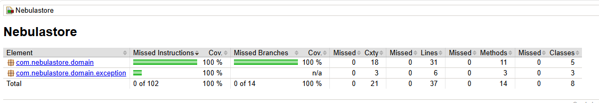

# Nebulastore

A pure Java domain model for a 3D printing store: custom print-on-demand orders, plus filament and machine sales. Built to practice Test-Driven Development (TDD) and clean domain design, with full unit test coverage.

## Overview

Nebulastore models the core business rules of a 3D printing shop as a framework-free domain layer (no Spring, no persistence). Every rule is isolated, independently testable, and covered by unit tests written with JUnit 5 and Mockito following the Arrange-Act-Assert (AAA) pattern.


## Project structure

```
Nebulastore/
├── pom.xml
├── README.md
├── docs/
│   └── coverage.png
└── src/
    ├── main/java/com/nebulastore/domain/
    │   ├── OrderCart.java
    │   ├── StockManager.java
    │   ├── QuantityValidator.java
    │   ├── PrintJobValidator.java
    │   ├── OrderService.java
    │   ├── OrderNotifier.java
    │   └── exception/
    │       ├── OutOfStockException.java
    │       ├── InvalidQuantityException.java
    │       └── ExceedsBuildVolumeException.java
    └── test/java/com/nebulastore/domain/
        ├── OrderCartTest.java
        ├── StockManagerTest.java
        ├── QuantityValidatorTest.java
        ├── PrintJobValidatorTest.java
        └── OrderServiceTest.java
```

## Domain components

| Component | Responsibility |
|-----------|----------------|
| `OrderCart` | Holds the current order state (total and item list) |
| `StockManager` | Validates available stock for filaments and machines |
| `QuantityValidator` | Ensures requested quantities are positive |
| `PrintJobValidator` | Enforces the printer build volume (X/Y/Z limits) for custom jobs |
| `OrderService` | Orchestrates order processing and triggers notifications |
| `OrderNotifier` | Notification contract (interface), injected into `OrderService` |

Custom domain exceptions live in the `exception` package: `OutOfStockException`, `InvalidQuantityException`, and `ExceedsBuildVolumeException`.

## Design principles

- **Pure domain**: no framework dependencies, keeping the business logic isolated and fast to test.
- **Dependency inversion**: `OrderService` depends on the `OrderNotifier` interface, not a concrete implementation, allowing the real notifier to be swapped for a mock in tests.
- **Business exceptions**: failures throw named domain exceptions instead of generic errors.

## Testing

The test suite covers four test styles:

- **State verification** — `OrderCartTest`
- **Exception testing** — `StockManagerTest` (`assertThrows` / `assertDoesNotThrow`)
- **Parameterized tests** — `QuantityValidatorTest` (`@ValueSource`) and `PrintJobValidatorTest` (`@CsvSource`)
- **Interaction testing with mocks** — `OrderServiceTest` (Mockito `verify`)

Run the tests and generate the coverage report:

```bash
mvn clean test
```

The HTML coverage report is generated at `target/site/jacoco/index.html`, and a summary table is printed to the console.

## Coverage

100% line and branch coverage across the domain:



## Tech stack

- Java 21
- Maven
- JUnit 5
- Mockito
- JaCoCo

