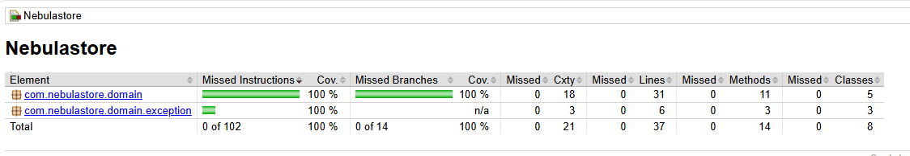
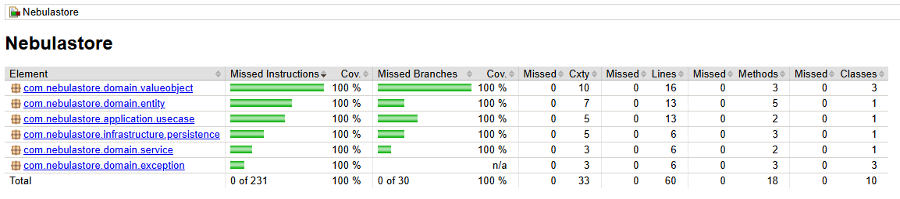

# Nebulastore

Pure Java backend for a 3D printing store: custom print-on-demand orders, plus filament and machine sales. Built practicing Test-Driven Development (TDD) and restructured under **Clean Architecture** and tactical **Domain-Driven Design (DDD)** patterns.

## Overview

Nebulastore models the core business rules of a 3D printing shop across three concentric layers — `domain`, `application`, and `infrastructure` — following the Dependency Rule: outer layers depend on inner ones, never the other way around. The domain core is pure Java, framework-free, and every interaction with the outside world (persistence, notifications) happens through interfaces (ports) defined inside the domain itself.

## Project structure

```
Nebulastore/
├── pom.xml
├── README.md
├── docs/
│   └── coverage.png
└── src/
    ├── main/java/com/nebulastore/
    │   ├── application/
    │   │   └── usecase/
    │   │       └── NewOrderUseCase.java
    │   ├── domain/
    │   │   ├── entity/
    │   │   │   └── Order.java
    │   │   ├── exception/
    │   │   │   ├── OutOfStockException.java
    │   │   │   ├── InvalidQuantityException.java
    │   │   │   └── ExceedsBuildVolumeException.java
    │   │   ├── repository/
    │   │   │   └── OrderRepository.java
    │   │   ├── service/
    │   │   │   └── StockManager.java
    │   │   ├── valueobject/
    │   │   │   ├── Quantity.java
    │   │   │   ├── PrintDimensions.java
    │   │   │   └── OrderItem.java
    │   │   └── OrderNotifier.java
    │   └── infrastructure/
    │       └── persistence/
    │           └── InMemoryOrderRepository.java
    └── test/java/com/nebulastore/
        ├── application/
        │   └── usecase/
        │       └── NewOrderUseCaseTest.java
        ├── domain/
        │   ├── entity/
        │   │   └── OrderTest.java
        │   ├── service/
        │   │   └── StockManagerTest.java
        │   └── valueobject/
        │       ├── QuantityTest.java
        │       ├── PrintDimensionsTest.java
        │       └── OrderItemTest.java
        └── infrastructure/
            └── persistence/
                └── InMemoryOrderRepositoryTest.java
```

**Dependency Rule:** `domain` never imports anything from `application` or `infrastructure`. `application` only knows `domain` interfaces. `infrastructure` is the only layer aware of concrete technology, and it is the one implementing the contracts the domain exposes.

## Before vs. After

| Aspect | Before | After |
|---|---|---|
| Package structure | Everything in a single flat `domain` package | Split into `domain` (`entity`, `valueobject`, `service`, `repository`, `exception`), `application.usecase`, and `infrastructure.persistence` |
| Data model | Anemic `OrderCart`: no identity, no behavior, plain getters only | `Order` is an Entity with its own `id` and the business method `addItem(...)` |
| Loose primitives | `int`, `double x/y/z` validated by separate `Validator` classes (`QuantityValidator`, `PrintJobValidator`) | Replaced by immutable Value Objects (`record`) that self-validate in their own constructor: `Quantity`, `PrintDimensions`, `OrderItem` |
| Persistence | No repository concept existed at all; nothing was actually saved | `OrderRepository` contract defined in the domain, with an in-memory implementation (`InMemoryOrderRepository`) in infrastructure |
| Use case | `OrderService` only sent notifications, with no duplicate validation and no dependency on a repository | `NewOrderUseCase` receives `OrderRepository` and `OrderNotifier` through its constructor, validates the order doesn't already exist, then saves and notifies |
| Dependency injection | Only applied to the notifier (`OrderNotifier`) | Also applied to persistence — zero use of `new` on concrete implementations inside business classes |
| Test coverage | 100% Line/Branch, but over an anemic domain | 100% Method/Branch/Line, now covering entities, value objects, use cases, and the persistence adapter |

## Evidence

**Test suite before the refactor:**



**Test suite after the refactor, full coverage:**



**Code before this refactor:** available at the [`hito2-snapshot`](https://github.com/Thoorcito/NEBULASTORE/tree/hito2-snapshot) branch, frozen at the last commit prior to this restructuring.

## Tech stack

- Java 21
- Maven
- JUnit 5
- Mockito
- JaCoCo

## How to run

Compile and verify the project:
```
mvn clean compile
```

Run the unit test suite and generate the coverage report (validates that the layers are properly decoupled):
```
mvn clean test jacoco:report
```

The HTML coverage report is generated at `target/site/jacoco/index.html`, and a summary is printed to the console.
